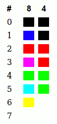

# Sinclair QL classic palettes
Sinclair QL classic palettes for use in Gimp and Photoshop, by Javier Guerra.

## About it

This is about the [Sinclair QL](https://en.wikipedia.org/wiki/Sinclair_QL "Sinclair QL info") retro-computer.

Here you can find the mode 8 and mode 4 color Sinclair QL palettes for Gimp (.gpl) and Photoshop (.act) programs.

## How to use

Import the palettes into your graphics program, and use it to draw or to convert images to the QL colors. Then, you can export the images in raw to convert it to native classic QL images.

## More info

Follow [this link](http://sinclairql.speccy.org/articulos/trucos/qlpal.htm "Exprimiendo la paleta del QL") (*in spanish*) to see more info about how to use this palettes in your graphics programs.

### Note

this is a fool resource ;) 
